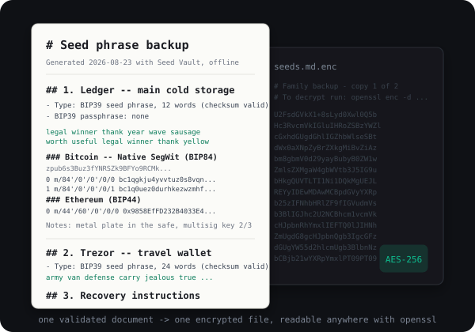
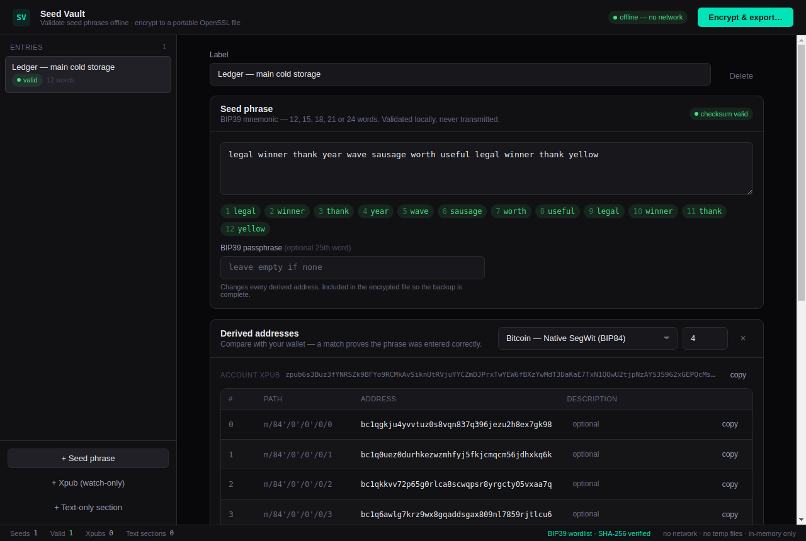
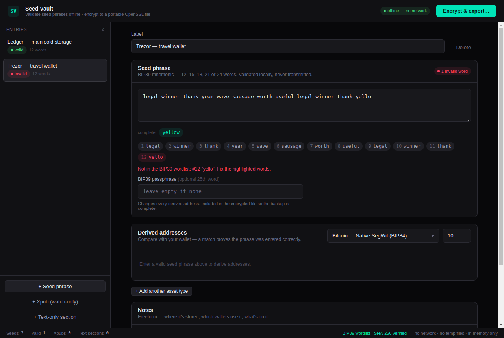
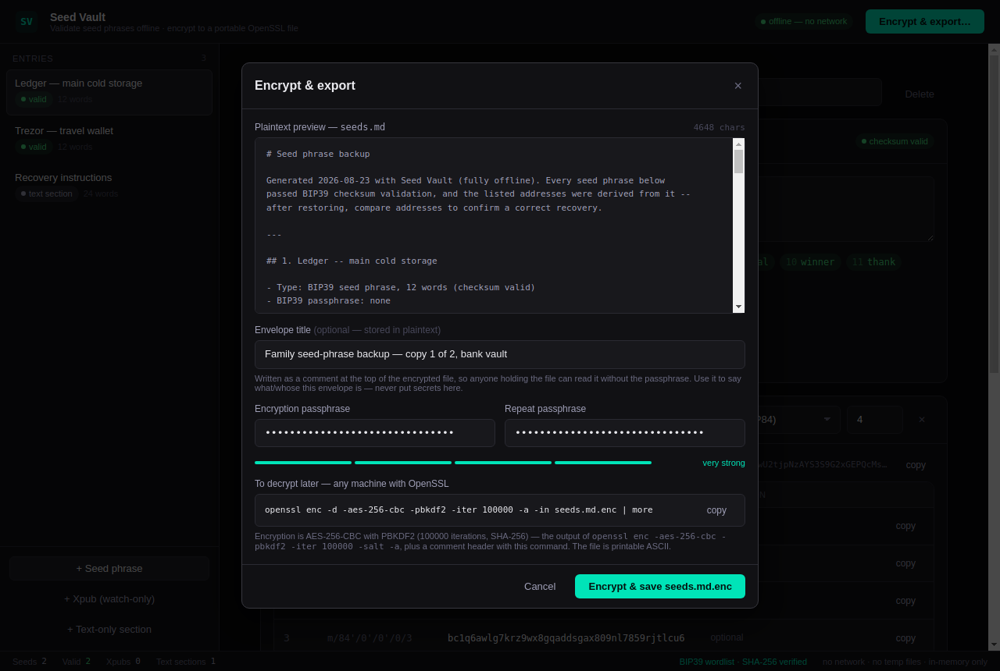

# Seed Vault

[](https://github.com/gearcat0/seedvault/actions/workflows/ci.yml)
[](https://codecov.io/gh/gearcat0/seedvault)

**Back up every seed phrase you own — quickly, safely, in one place.**

Do you have seed phrases scattered around? A notebook page here, a sticky note
there, a napkin in a drawer, a "temporary" note on a phone you've been meaning
to wipe? Have you been meaning to get organized and clear them off those
devices before something bad happens?

Seed Vault is a small desktop app that does exactly that job, in an afternoon:

- **Paste or type each phrase** and know immediately that it's right — every
  word is checked against the BIP39 wordlist, the checksum is verified, and
  typos get highlighted with the intended word suggested.
- **Prove it's the real one.** The app derives the actual Bitcoin, Ethereum,
  Solana and Tron addresses from each phrase so you can compare them with
  your wallet. A match means the backup will recover the right funds.
- **Write down where each one lives** — which device, which wallet, what's on
  it — right next to the phrase, so future-you (or your family) isn't guessing.
- **Encrypt everything into a single file** with a passphrase you choose. The
  output is a standard OpenSSL envelope: printable text you can print, copy
  to a USB stick, e-mail to yourself, or put in a safe — and decrypt on *any*
  computer with one command, no Seed Vault required.
- **Nothing ever leaves your machine.** The app has no network access by
  design and writes nothing to disk except the encrypted file you ask for.

Rest assured that you will always be able to recover your seeds.

<table>
  <tr>
    <td align="center"><b>Before</b> — seeds everywhere, nothing verified</td>
    <td align="center"><b>After</b> — one validated document, one encrypted file</td>
  </tr>
  <tr>
    <td></td>
    <td></td>
  </tr>
</table>

## Download

Prebuilt, **unsigned** installers for Linux (AppImage, deb), macOS (dmg) and
Windows (installer + portable exe) are attached to each
[GitHub Release](https://github.com/gearcat0/seedvault/releases). Because
they are not yet code-signed, macOS Gatekeeper and Windows SmartScreen will
warn on first launch (right-click → Open on macOS; "More info → Run anyway"
on Windows). Or build it yourself — see [Develop](#develop).

## Screenshots

A validated 12-word phrase (a published BIP39 test vector) with its derived
Bitcoin addresses and account zpub, ready to compare against a wallet:



A transcription error caught as you type — the bad word is highlighted, the
wordlist completion is offered, and nothing is derived until the checksum passes:



Encrypt & export: plaintext preview of `seeds.md`, a plaintext envelope
title, passphrase strength, and the exact `openssl` command to decrypt later:




## How it works

Desktop app (Electron) for backing up BIP39 seed phrases. Each phrase is
validated offline (wordlist + checksum), real addresses are derived for
Bitcoin (Native SegWit / Nested-SegWit-P2SH / Legacy), Ethereum, Solana and Tron so you can compare against
your wallet and catch transcription errors, and everything is encrypted into a
single `seeds.md.enc` file that any machine with OpenSSL can decrypt:

```sh
openssl enc -d -aes-256-cbc -pbkdf2 -iter 100000 -a -in seeds.md.enc | more
```

The file is printable ASCII: a `#` comment header carrying an optional
envelope title (plaintext — visible without the passphrase), the generation
timestamp, the decrypt command with the actual file name, and the local
`openssl version` at creation time (OpenSSL skips these lines when
decrypting), followed by the base64-armored ciphertext — safe to print,
paste, or archive anywhere. Entries can be reordered by dragging in the
sidebar; the order becomes the section order in the backup.

The decrypted `seeds.md` is pure 7-bit ASCII: typographic characters (em/en
dashes, smart quotes, ellipses) are transliterated, and any other non-ASCII in
a label/note/passphrase is escaped losslessly as `\uXXXX` (a non-ASCII
passphrase is additionally flagged, since it must be restored as the original
characters). Nothing is dropped.

Each derivation section in the backup also carries every address's
wallet-importable private key (WIF for Bitcoin, hex for Ethereum/Tron,
Phantom-style base58 keypair for Solana) so a single account can be restored
without importing the whole seed, plus the account xpub (zpub for BIP84) for
watch-only balance discovery. Solana has no xpub — SLIP-0010 ed25519 is
hardened-only.

## Guarantees

- **Zero network.** Enforced three ways: `webRequest` deny-all in the main
  process, `connect-src 'none'` CSP in the page, and no remote content anywhere.
- **No temp files.** Entries live in memory only; the sole file ever written is
  the ciphertext, through the OS save dialog. The main process refuses to write
  anything that doesn't start with the OpenSSL `Salted__` header.
- **OpenSSL-compatible output.** AES-256-CBC, PBKDF2-HMAC-SHA256, 100000
  iterations, `Salted__` envelope, base64-armored (`-a`) with a comment
  header. The test suite round-trips against the real `openssl` CLI in both
  directions, comments included.
- **Self-testing crypto.** On every launch the renderer re-checks published
  test vectors (BIP39, BIP84/BIP44, SLIP-0010, keccak/ripemd, OpenSSL
  round-trip, wordlist SHA-256) and refuses to run if any fail.
- Clipboard copies are cleared after 30 s (unless you copied something else
  since); Chromium spellcheck is disabled; closing with entries warns first.

## Stack

- Electron (sandboxed renderer, context isolation, no node integration)
- React + the `evm-ui` design system (`../evm-ui`)
- Audited crypto: `@scure/bip39`, `@scure/bip32`, `@noble/curves`,
  `@noble/hashes`, `@scure/base`; WebCrypto for the OpenSSL envelope

## Develop

```sh
npm install
npm start          # build renderer + launch (add `-- --no-sandbox` in containers)
npm test           # crypto/markdown suite incl. OpenSSL CLI round-trip
npm run test:coverage  # same, plus a coverage table and coverage/lcov.info
npx tsc --noEmit   # typecheck
npm run dist       # package installers for this OS into release/ (unsigned)
```

Releases are cut by pushing a `v*` tag: `.github/workflows/release.yml`
builds on Linux, macOS and Windows and attaches the installers to the
GitHub Release for that tag.

Layout: `main.js` / `preload.js` (Electron main), `index.html` + `src/`
(renderer; `src/lib/seedcrypto.ts` is all the crypto), `test/`,
`.github/workflows/ci.yml` (typecheck + tests + coverage upload on every push).
